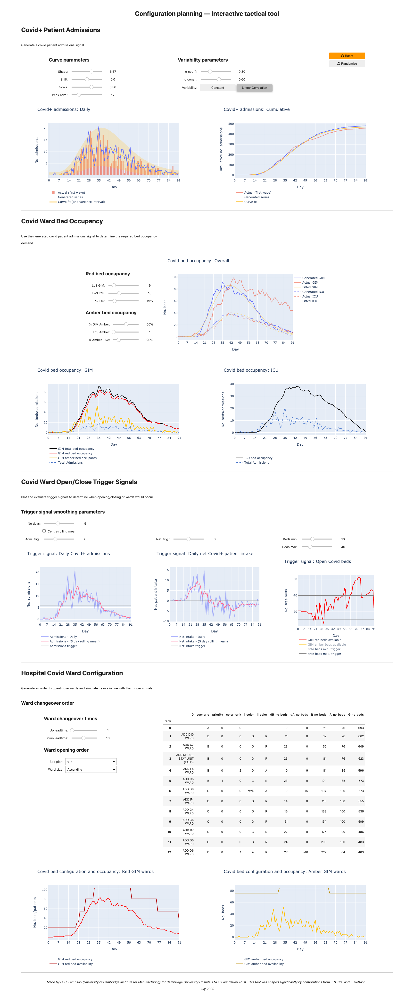
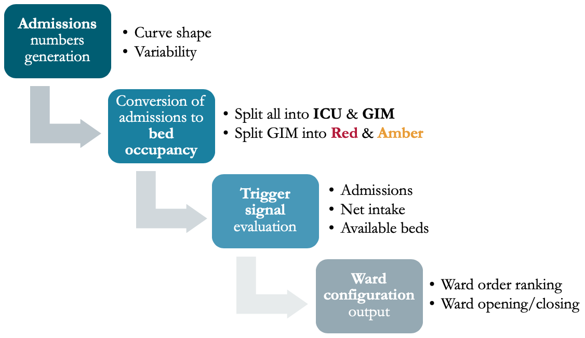

# Tactical tool for CUH Covid configuration planning
An interactive dashboard used by decision makers at a university hospital to evaluate strategies for ward re-configuration* during the 2020 coronavirus pandemic.

This tool helped hospital management develop their understanding of the impact their __decisions__ and their __assumptions__ would have on the hospital's ability to treat a varying "wave" of Covid patients along with their capacity to continue to serve their "normal" patient demand.

*__Note:__ ward re-configuration refers to whether a ward is allocated to patients who: (1) definitely have Covid; (2) potentially have Covid; and (3) definitely do not have Covid. These classifications were termed Red, Amber, and Green, respectively.

## Full screenshot of the interactive tool


## Tool architecture

The tool is comprised of four stages:
1. Admissions numbers generation
2. Conversion of those admissions numbers to bed occupancy
3. Trigger signal evaluation
4. Ward configuration output

__Further explanation is contained within the full report, available on request.__ This work was undertaken as part of my MPhil dissertation at the University of Cambridge.

---
# Development

## 0. Getting setup
This project uses an Anaconda environment that contains all the required Python package dependencies. 

### 0.1. Install Anaconda
First, you'll need to install Anaconda. Follow [the instructions their website](https://docs.anaconda.com/anaconda/install/).

### 0.2. Create a conda environment for the project
To get started, just run the included `setup.sh` bash script (note permissions issues may require you to run the commands manually):
```bash
# create the conda environment and install dependencies
conda create --name cuhvid --file requirements.txt
# add local modules to environment
conda develop .
```

This creates a conda environment called `cuhvid` and installs all the dependencies. It then adds the project folder to the conda environment to allow the local package (also called `cuhvid`) to be used.

## 1. Serve the interactive dashboard on local machine
You can serve an interactive version of the notebook as a dashboard by activating the `cuhvid` conda environment and serving the Jupyter notebook using Voila by running the included `conda_env.sh` and `serve.sh` bash scripts:
```bash
bash conda_env.sh  # may not work, see below
bash serve.sh
```

### 1.1 Problems activating the conda environment
You may not be able to activate the conda environment with the `conda_env.sh` script. If so, run:
```bash
# activate the project's conda environment
source /opt/anaconda3/bin/activate
conda activate cuhvid
# serve voila app
bash serve.sh
```
